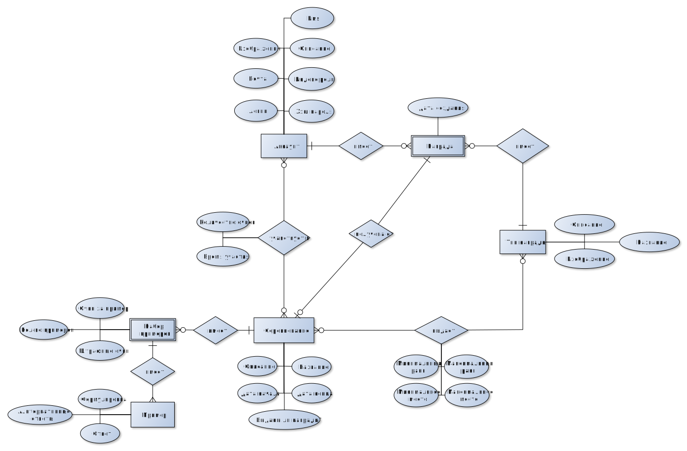

[[_TOC_]]

### Лабораторная работа №
#### Название проекта
Математическая соревновательная игра "Быстрый расчёт" 

#### Краткое описание идеи проекта (1 абзац, 3 предложения);
Создать приложение, в котором игроки могут соревноваться в математической игре между собой за награды. Соревнование имеют срок, в течении которого игроки могут проходить уровень (решать на скорость уравнения) и посылать свои результаты (очки). На основании очков строится таблица лидеров, по которой определяется награждаемые игроки. 

#### Краткое описание предметной области (1 абзац);
Игроки могут учавствовать в соревнованиях благодаря прохождению уровня соревнования (список примеров). После успешного прохождения отправляются очки.
Соревнования имеют определённый срок, после чего они заканчиваются, и в них больше учавствовать нельзя.
Награды выдаются исходя из таблицы лидеров соревнования на срок окончания соревнования. 

#### Краткое обоснование целесообразности и актуальности проекта (1 абзац);
Математическая игра, имея соревновательный контекст, позволит популяризовать навыки быстрого счёта среди населения.

#### Краткое описание акторов (ролей);
Гость - смотрит на соревнования и игроков.

Игрок - участвует в соревнованиях, получает награды.

Админинстратор - редактирует соревнования, виды наград, инвентари отдельных пользователей.

#### Use-Case - диаграмма 

#### ER-диаграмма сущностей

#### Пользовательские сценарии 
1. Пользователь не авторизуется, является гостем. Просматривает текущие соревнования. Смотрит на таблицу лидеров. Просматривает профиль самого лучшего игрока. Выходит.

2. Пользователь авторизуется, становится игроком. Просматривает текущие соревнования. Решает поучавствовать в первом из них. Играет в игру, считаются очки, результат отправляется. Смотрит на таблицу лидеров. Просматривает профиль самого лучшего игрока. Выходит.

3. Пользователь авторизуется, становится админинстратором. Создаёт новое соревнование. Настраивает награды за соревнования. Назначает сроки. Выходит.

#### Формализация ключевых бизнес-процессов 

#### Описание типа приложения и выбранного технологического стека
Тип приложения - Desktop

Технологический стек:
1. backend - C# ASP.NET Core (REST API)
2. frontend - TypeScript + React
3. БД - PostgreSQL для хранения данных
#### Верхнеуровневое разбиение на компоненты

